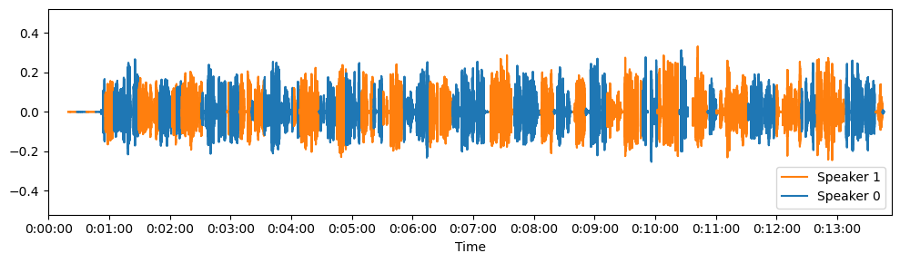
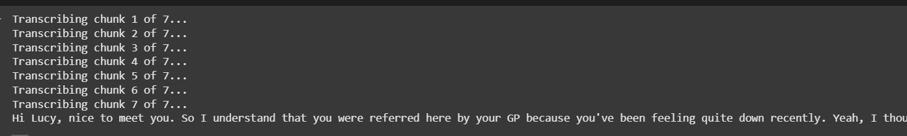

# 🎙️ Audio to Text Transcription with Speaker Diarization

This project processes long audio files (e.g., `.mp3`) into clean, speaker-separated transcripts using audio enhancement, speaker diarization, and OpenAI's Whisper model.

---

### 🚀 Features

- 🎧 Converts `.mp3` audio to `.wav` format
- ✂️ Splits long audio into smaller chunks
- 🎛️ Enhances audio quality
- 🧠 Transcribes using OpenAI's Whisper (medium model)
- 🗣️ Identifies speakers (diarization)
- 📝 Outputs timestamps and who spoke what
- 💾 Saves results in `.txt`, `.docx`, and more

---

### 🧰 Libraries & Tools Used

- [`whisper`](https://github.com/openai/whisper) (OpenAI transcription)
- `pyannote.audio`, `simple_diarizer`
- `pydub`, `soundfile` (audio handling)
- `matplotlib` (visualization)
- `torch`, `numpy`, `pandas`

---

### 📌 How to Use

1. Open any Colab link above.
2. Upload your `.mp3` audio file.
3. Provide the file path in the input cell.
4. Run all cells (`Shift + Enter`).
5. Receive:
   - 📊 A plotted waveform with speaker labels
   - 📝 A text-based transcript with timestamps

---

### 🎯 Sample Output



```
Transcript Sample [00:00:00] Speaker 1: Hi Lucy, nice to meet you. So I understand that you were referred here by your GP...
[00:00:10] Speaker 0: Yes, that's right. I've been feeling quite down lately...
```

---
